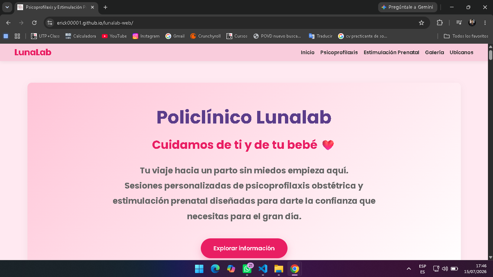
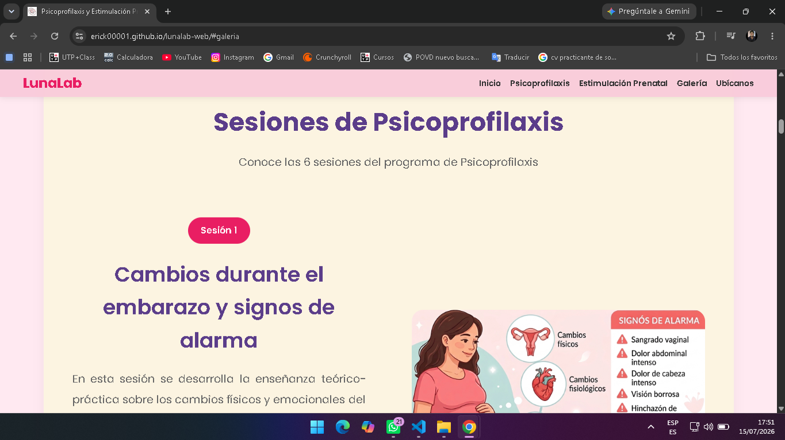
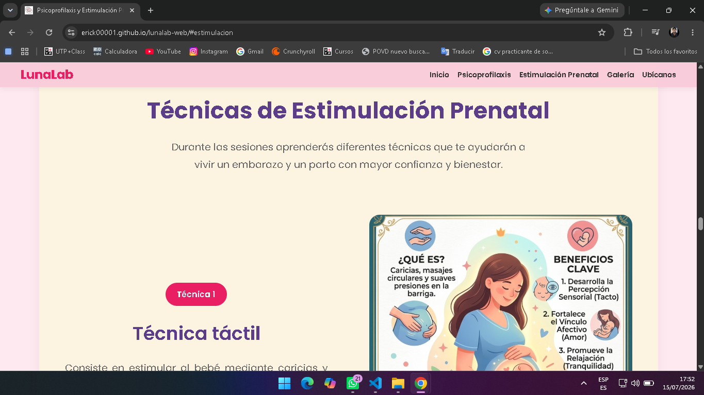
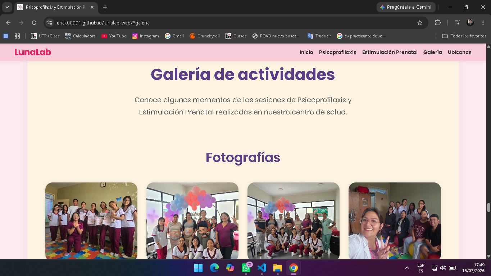
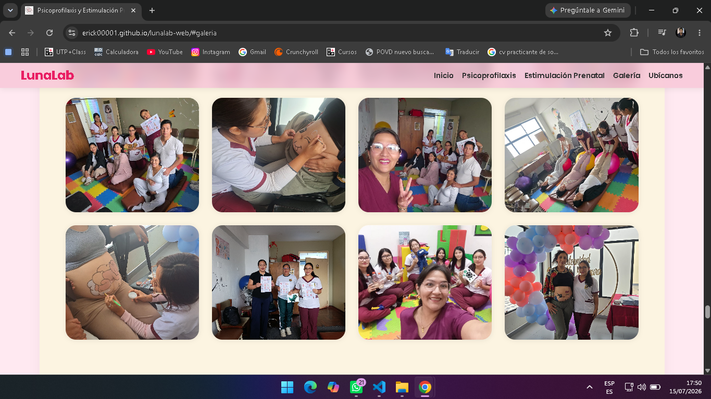
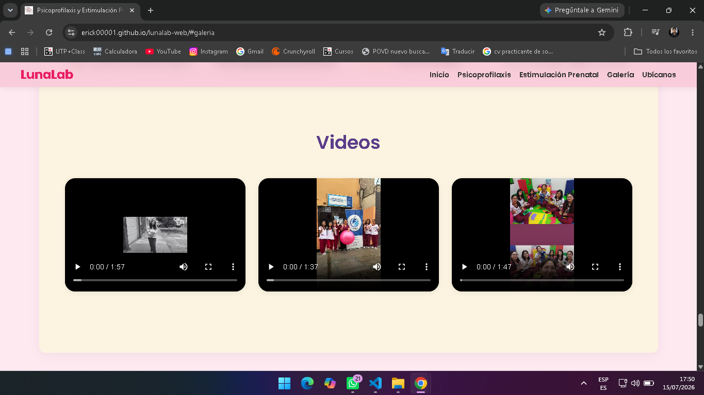
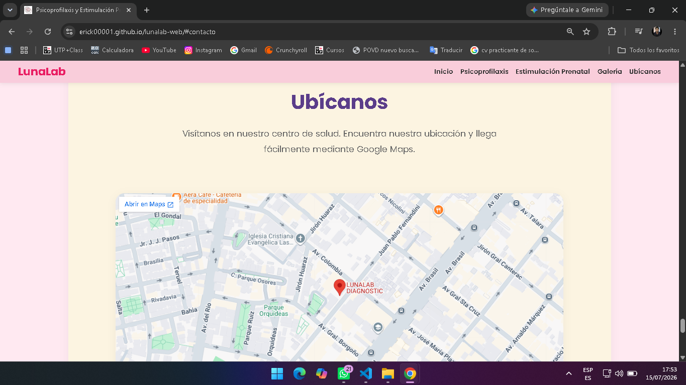

# 🌸 LunaLab

Sitio web informativo desarrollado para el Policlínico LunaLab, donde brindan servicios de Psicoprofilaxis Obstétrica y Estimulación Prenatal.

El proyecto fue desarrollado como una página web moderna, responsiva e intuitiva, con el objetivo de brindar información sobre los servicios ofrecidos, mostrar contenido multimedia real y facilitar el acceso a la información del policlínico y sus servicios.

---

# 🌐 Demo

🔗 **Ver sitio web:ㅤ**  https://erick00001.github.io/lunalab-web/

---

# 🛠️ Tecnologías utilizadas

- **HTML5** → Estructura del sitio web.
- **CSS3** → Diseño, estilos y diseño responsivo.
- **JavaScript** → Interactividad y funcionalidades dinámicas.
- **Git** → Control de versiones.
- **GitHub** → Repositorio del proyecto.
- **GitHub Pages** → Publicación del sitio web.

---

# ✨ Características

- 📱 Diseño totalmente responsivo para computadoras, tablets y celulares.
- 🎨 Interfaz moderna con una paleta de colores suaves y agradable.
- 📑 Navegación intuitiva mediante un menú responsivo.
- 🖼️ Galería de imágenes con visualización ampliada (Lightbox).
- 🎥 Integración de contenido multimedia (videos).
- 📜 Animaciones al desplazarse por la página (Scroll Reveal).
- 🗺️ Mapa interactivo de Google Maps para visualizar la ubicación.
- 🔍 Implementación de SEO básico mediante etiquetas meta.
- 📂 Organización del proyecto en carpetas para facilitar su mantenimiento.

---

# 📷 Capturas del proyecto
##
## 🏠 Página principal



##
## 🩺 Servicios




##
## 🖼️ Galería





##
## 📍 Ubicación



---

# 📂 Estructura del proyecto

```text
lunalab-web/
├── assets/
│   └── screenshots/
├── css/
│   └── style.css
├── icons/
├── img/
├── js/
│   └── script.js
├── pages/
├── videos/
├── index.html
└── README.md
```

---

# 🚀 Cómo ejecutar el proyecto

1. Clona este repositorio:

```bash
git clone https://github.com/erick00001/lunalab-web.git
```

2. Abre la carpeta del proyecto.

3. Ejecuta el archivo `index.html` en tu navegador o utiliza una extensión como **Live Server** en Visual Studio Code para una mejor experiencia durante el desarrollo.

---

# 👨‍💻 Autor

**Erick**

Estudiante de Ingeniería de Sistemas e Informática.

- GitHub: [@erick00001](https://github.com/erick00001)

